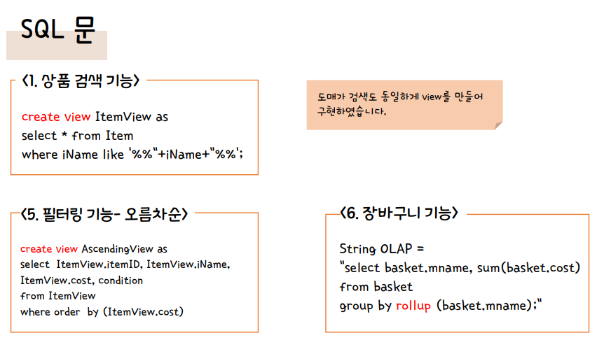

# 🥦농산물 오프라인 가격비교 서비스

## 🤜 프로젝트 개요

동일한 상품이지만, 마트마다 가격이 다른 경우가 많고, 온라인 마켓에서는 가격비교가 있지만 오프라인으로는 찾기가 쉽지 않음

→ 오프라인 마트의 가격을 비교해줄 필요가 있음

## 👩 나의 역할

- 기본동작코드(JDBC 이용하여 DB와 연결)
- 필터링 및 검색 관련 SQL문 작성

## 🎈 프로젝트 기능 설명

- `상품 검색 기능`

  검색창에 구매하고자 하는 상품을 입력하면, 원하는 방식으로 보여준다.

- `도매가 검색 기능`

  상품의 도매가를 검색하여 확인하고, 실판매가와 비교할 수 있다.

- `필터링 기능`

  원하는 조건(최저가, 오름차순)대로 상품을 비교하여 준다.

- `장바구니 기능`

  원하는 상품들을 장바구니에 넣어, 예상 금액을 확인할 수 있다.

- `SQL문`

  

## 🛠 기술 스택

- DBMS: Postgre

- 언어: Java

- 공공데이터:

  - 공공 데이터 활용

    https://www.data.go.kr/data/15004517/openapi.do

  - 공공 데이터에서 연결된 사이트

    https://www.garak.co.kr/publicdata/selectPageListPublicData.do

  - 서울시 공공 데이터 활용

    https://data.seoul.go.kr/dataList/OA-1170/S/1/datasetView.do

    https://data.seoul.go.kr/dataList/OA-1176/S/1/datasetView.do

